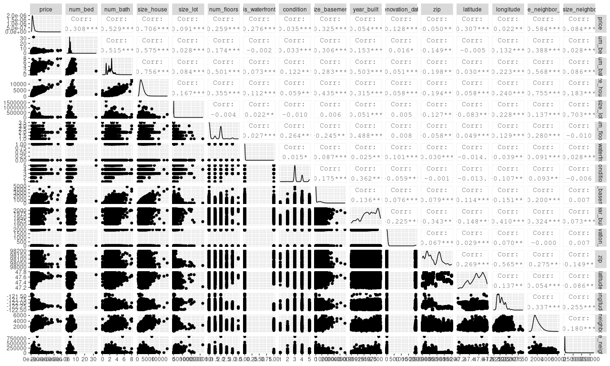

### Introdução

Abrindo o projeto (`Rappi_case_housing.Rproj`) será possível encontrar o script R com o passo a passo para a realização do test do modelo criado. Esse arquivo HTML contém toda a descrição do que foi feito para o desenvolvimento do modelo. Para testar o modelo, abra o arquivo `scriptParaTestagemDoModelo.R`, após abrir o projeto, e siga o passo a passo.

### EDA

Com a função skim do pacote skimr, podemos notar que o arquivo não possui NA ou Nan em nenhuma das colunas, entre algumas estatísticas das variáveis numéricas (no caso todas.)
Além disso, a função ggpairs do pacote GGally nos permite plotar todos os gráficos relacionando todas as variáveis numéricas. O output dessa função não foi incluído porque a visualização de todas essas variáveis ficaria muito poluído e não seria possível identificar muita coisa. Realizei apenas o plot da variável price por num_bed e size_house como ilustração para fins de comparação com o plot completo do ggpairs.


```{r setup, include=FALSE}
# Pacotes ------------------------------------------------------------------
library(tidyverse)
library(tidymodels)
library(skimr)

# Dados -------------------------------------------------------------------
path <- "house_sales.csv"
housing <- read_csv(path)
housing_initial_split <- housing %>% initial_split(3/4)
housing_train <- housing_initial_split %>% training()
housing_test <- housing_initial_split %>% testing()
```

```{r include=TRUE, echo=FALSE, message=FALSE}
# EDA ---------------------------------------------------------------------
# data %>% 
#   glimpse()
skim(housing)

GGally::ggpairs(housing %>% select(price, num_bed, size_house))
```


Testei algumas visualizações (abaixo) buscando padrões nas curvas separando por _condition_ e _is_waterfront_ que se relacionassem com o preço.

Por não conseguir encontrar nenhum padrão interessante no momento, encerro aqui a análise exploratória.

```{r include=TRUE, echo=FALSE, message=FALSE}
# EDA ---------------------------------------------------------------------
housing %>% 
    ggplot(aes(x = (size_house), y = (price), color = as.factor(condition)))+
  # geom_point(size = 0.5)+
  geom_smooth()
housing %>% 
    ggplot(aes(x = (size_lot), y = (price), color = as.factor(is_waterfront)))+
  geom_point(size = 0.5)+
  geom_smooth()
```

### Modelo

Na construção do modelo, optei por um modelo de árvore de decisão com somente dois steps na receita, um que remove variáveis com variância nula, e outro que normalizasse as variáveis preditoras numéricas, para que a escala diferente delas não afete na sua importância. O workflow a seguir já está finalizado após a tunagem dos hiperparametros _mtry_ e _min_n_, selecionando os melhores contidos no grid abaixo baseado no _rmse_.

```{r include=TRUE, echo=FALSE, message=FALSE}

# DATAPREP --------------------------------------------------------------
housing_recipe <- recipe(price ~ ., housing_initial_split) %>% 
  step_zv(all_predictors()) %>%
  step_normalize(all_predictors()) 

# MODELO ------------
housing_model <- rand_forest(
  mtry = 12,
  trees = 150,
  min_n = 15
) %>% 
  set_mode("regression") %>% 
  set_engine("randomForest")

# WORKFLOW -----------------------
housing_wf <- workflow() %>% 
  add_model(housing_model) %>% 
  add_recipe(housing_recipe)
housing_grid <- expand.grid(
  mtry = c(4, 6, 8, 10, 12),
  # trees = c(100, 120, 150, 175, 200),
  min_n = c(15, 20, 25, 30, 35, 40)
)
housing_grid %>% DT::datatable()
housing_wf
```

### Visualizações das previsões

Abaixo seguem duas visualizações das previsões realizadas na base de teste. A primeira compara o predito com o preço real, junto com a reta bissetriz do plano. Na segunda visuzalição temos a tendencia do erro (real - predito) com relação ao predito.

```{r include=TRUE, echo=FALSE, message=FALSE}
housing_last_fit <- last_fit(housing_wf, split = housing_initial_split)

housing_test_preds <- collect_predictions(housing_last_fit)

# VISUALIZAÇÃO DAS PREVISÕES NA BASE DE TREINO-------------
housing_test_preds %>%
  # filter(x > 0) %>%
  ggplot() +
  geom_point(aes(.pred, price)) +
  geom_abline(slope = 1, intercept = 0, colour = "purple", size = 1) +
  theme_bw()

housing_test_preds %>%
  ggplot(aes(.pred, ((price)-(.pred)))) +
  geom_point() +
  geom_smooth(se = FALSE)

housing_last_fit$.metrics %>% data.frame() %>% DT::datatable()
```

Com um pouco mais de tempo seria interessante analisar a importância das variáveis e tentar buscar algum step de interação entre elas e analisar a importancia.

```{r include=TRUE, echo=FALSE, message=FALSE}
housing_fit <- housing_wf %>% fit(data = housing)

vip::vi(housing_fit$fit$fit) %>%
  mutate(
    abs_importance = abs(Importance),
    Variable = fct_reorder(Variable, abs_importance)
  ) %>%
  # arrange(desc(mportance)) %>% 
  head(15) %>% 
  ggplot(aes(x = abs_importance, y = Variable)) +
  geom_col()

```